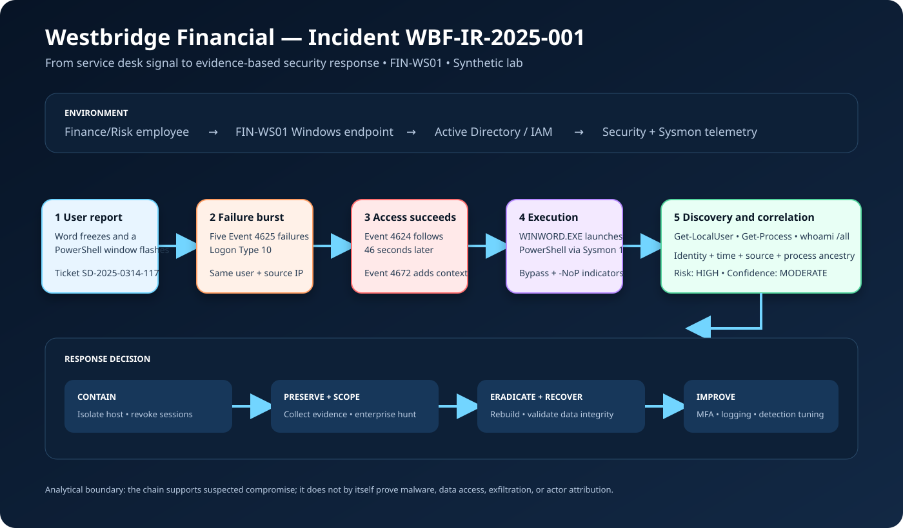

# Financial Services Windows Incident Response Lab

A portfolio-scale investigation for **Westbridge Financial**, a fictional financial-services firm. The lab correlates Windows authentication events with Sysmon process telemetry on Finance/Risk workstation `FIN-WS01`.

> Every user, host, address, ticket, and log is synthetic. No malware is executed and no production data is used.



## Executive finding

Five failed remote-interactive logons for `jsmith` from an external documentation address were followed by a success, privileged-token assignment, and PowerShell launched by Word. The command performed account and process discovery. This is assessed as a **high-risk suspected account and endpoint compromise**, not a confirmed breach: the evidence supports containment but does not prove data access or exfiltration.

## Skills demonstrated

- Windows Events **4624**, **4625**, **4672**, and Sysmon Event **1**
- Authentication-to-process correlation and explainable detection logic
- Python parsing, PowerShell triage, automated tests, and JSON/Markdown reporting
- Evidence-based MITRE ATT&CK mapping and NIST CSF 2.0 response planning
- Business-risk analysis and service desk-to-security escalation

## Repository map

```text
detection/          Python detector and PowerShell triage
evidence/           Synthetic JSONL and analysis notes
incident-report/    Summary, timeline, and risk assessment
mitre/              Evidence-to-ATT&CK mapping
notes/              Contextual cybersecurity vocabulary
remediation/        Prioritized response and control plan
tests/              Python unit tests
```

## Run it

Python 3.10+ is sufficient; there are no third-party dependencies.

```bash
python3 detection/event_parser.py evidence/sample-events.jsonl
python3 detection/event_parser.py evidence/sample-events.jsonl --format json
python3 -m unittest discover -s tests -v
```

On Windows, the companion script can inspect an exported CSV or query local Security and Sysmon logs with appropriate rights:

```powershell
.\detection\powershell-detection.ps1 -CsvPath .\exported-events.csv
.\detection\powershell-detection.ps1 -Hours 24
```

## Detection model

The detector raises explainable findings for a failure burst, a success from the same source within 15 minutes, privileged-token assignment, PowerShell process creation, suspicious parents/arguments, and discovery commands. The fixture includes benign noise so correlation—not PowerShell's mere presence—drives the conclusion. Thresholds are lab assumptions, not universal production rules.

## Analyst conclusion

The leading hypothesis is compromised credentials followed by user-context execution. Confidence is **moderate** because network, EDR, identity-provider, email, and memory evidence are absent. Read the [incident summary](incident-report/incident-summary.md), [timeline](incident-report/investigation-timeline.md), [risk assessment](incident-report/risk-assessment.md), and [remediation plan](remediation/recommendations.md).

The [vocabulary notes](notes/vocabulary-notes.md) explain the investigation’s identity, endpoint, detection, response, evidence, risk, SOX, NIST, and ATT&CK terminology—including common distinctions that prevent overclaiming.

## References and limitations

- [NIST Cybersecurity Framework 2.0](https://www.nist.gov/publications/nist-cybersecurity-framework-csf-20)
- [MITRE ATT&CK PowerShell (T1059.001)](https://attack.mitre.org/techniques/T1059/001/), [Valid Accounts (T1078)](https://attack.mitre.org/techniques/T1078/), [Account Discovery (T1087)](https://attack.mitre.org/techniques/T1087/), and [Process Discovery (T1057)](https://attack.mitre.org/techniques/T1057/)

Event 4672 means sensitive privileges were assigned to a logon; service accounts can generate it routinely. Public IPs use IANA documentation ranges. Production deployment would need baselining, allowlists, identity/device context, retention controls, and tuning.
